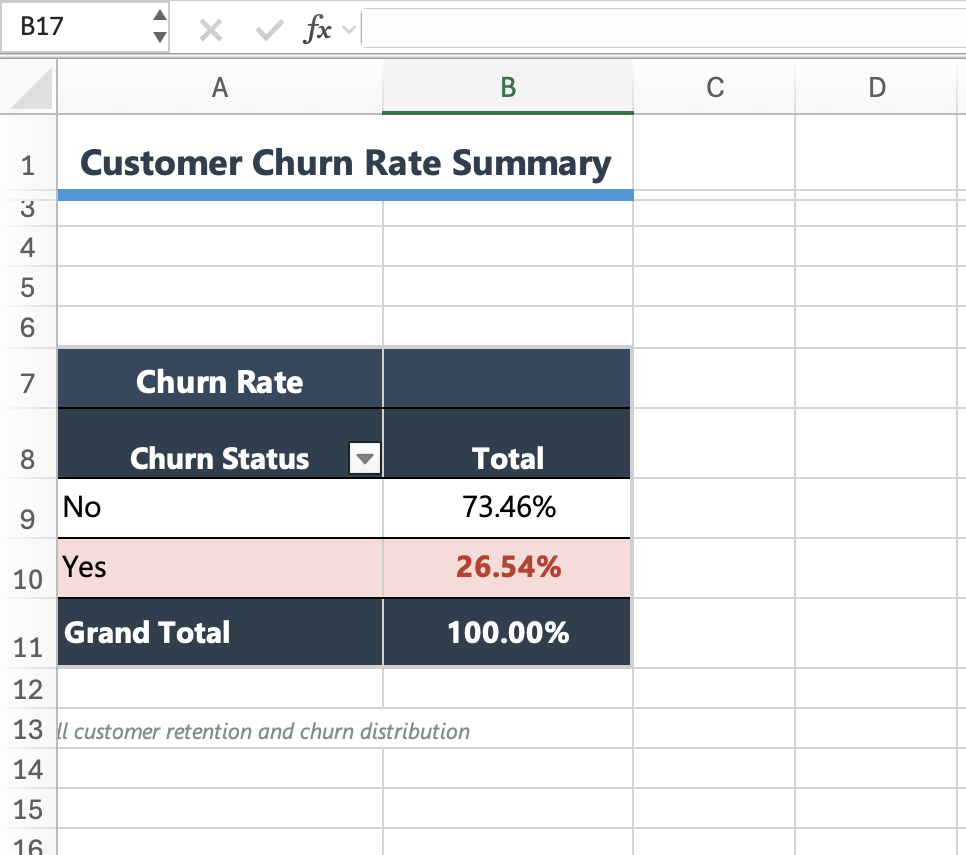
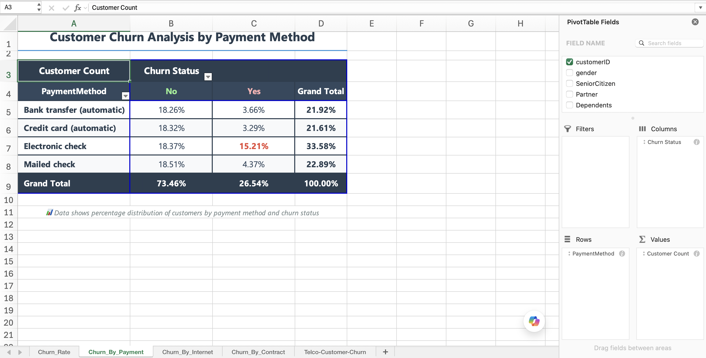
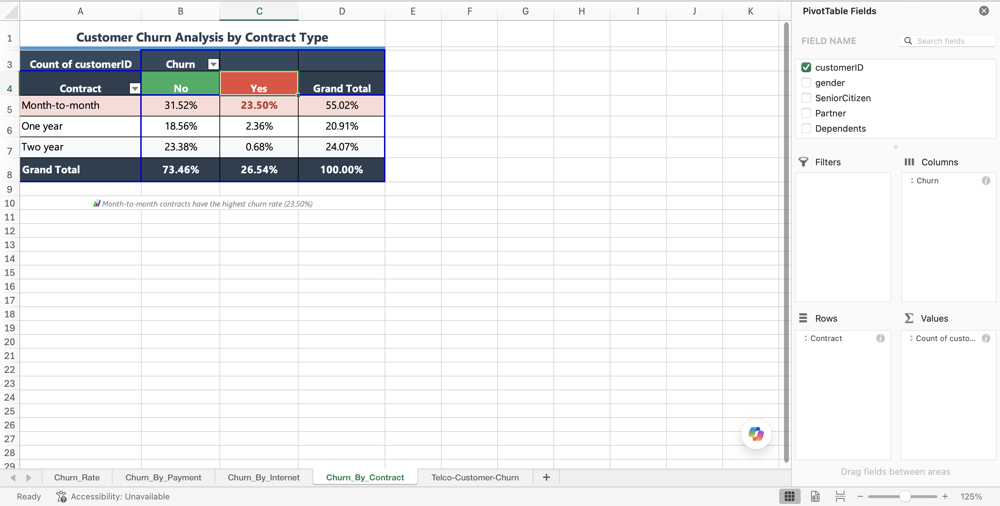
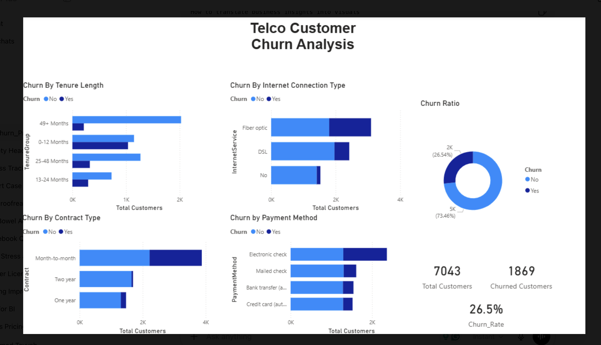

# Telco Customer Churn Analysis

## Project Overview

This project analyzes customer churn behavior for a telecommunications company using Excel, PostgreSQL, SQL, and Power BI.

The goal was to identify customer segments with higher churn risk, analyze revenue impact, and build a dashboard that summarizes churn patterns across contract type, payment method, internet service, tenure, and billing behavior.

---

## Tools Used

- Excel
- PostgreSQL
- SQL
- Power BI
- DAX
- GitHub

---

## Dataset

The project uses the Telco Customer Churn dataset.

Dataset details:

- 7,043 customer records
- One row per customer
- Customer demographics
- Service subscriptions
- Contract type
- Payment method
- Monthly charges
- Total charges
- Churn status

Main columns used:

- `customerID`
- `gender`
- `SeniorCitizen`
- `Partner`
- `Dependents`
- `tenure`
- `PhoneService`
- `InternetService`
- `Contract`
- `PaperlessBilling`
- `PaymentMethod`
- `MonthlyCharges`
- `TotalCharges`
- `Churn`

---

## Business Questions

This project focused on answering the following questions:

1. What is the overall customer churn rate?
2. Which contract types have the highest churn?
3. Which payment methods are associated with higher churn?
4. Does internet service type affect churn behavior?
5. Are newer customers more likely to churn?
6. What customer segments represent the highest churn risk?
7. What is the revenue impact of churned customers?

---

## Project Workflow

### 1. Excel Exploratory Analysis

Excel was used for the initial exploratory data analysis.

The Excel phase included:

- Creating Pivot Tables
- Calculating overall churn distribution
- Analyzing churn by contract type
- Analyzing churn by payment method
- Analyzing churn by internet service
- Creating tenure groups
- Comparing churn across customer lifecycle groups

Excel helped identify the first major churn patterns before moving into SQL and Power BI.

---

## Excel Analysis Preview

### Overall Churn Rate Summary



### Payment Method vs Churn



### Internet Service vs Churn


### Contract Type vs Churn



---

### 2. PostgreSQL / SQL Analysis

PostgreSQL was used to perform structured data analysis and create reusable SQL queries.

The SQL phase included:

- Creating a PostgreSQL table
- Importing the CSV dataset
- Validating row counts
- Checking data types
- Cleaning the `TotalCharges` field
- Calculating churn KPIs
- Segmenting customers by churn behavior
- Analyzing revenue impact
- Using `CASE` statements
- Using Common Table Expressions (CTEs)
- Using window functions

SQL queries are stored in the `sql/` folder.

---

## SQL Files Included

The project includes the following SQL scripts:

```text
01_overall_churn_rate.sql
02_churn_by_contract.sql
03_churn_by_payment_method.sql
04_churn_by_internet_service.sql
05_revenue_by_churn.sql
06_tenure_group_analysis.sql
07_churn_by_senior_citizen.sql
08_churn_by_paperless_billing.sql
09_high_risk_customer_segments.sql
10_top_revenue_loss_segments.sql
11_churn_rate_ranking.sql
12_customer_lifetime_value_analysis.sql
```

---

## SQL Query Highlights

### Overall Churn Rate

```sql
SELECT
    Churn,
    COUNT(*) AS customer_count,
    ROUND(
        COUNT(*) * 100.0 /
        SUM(COUNT(*)) OVER (),
        2
    ) AS percentage
FROM telco_customers
GROUP BY Churn;
```

### Churn by Contract Type

```sql
SELECT
    Contract,
    Churn,
    COUNT(*) AS customer_count,
    ROUND(
        COUNT(*) * 100.0 /
        SUM(COUNT(*)) OVER (
            PARTITION BY Contract
        ),
        2
    ) AS percentage
FROM telco_customers
GROUP BY Contract, Churn
ORDER BY Contract, Churn;
```

### High-Risk Customer Segments

```sql
WITH segment_churn AS (
    SELECT
        Contract,
        PaymentMethod,
        InternetService,
        COUNT(*) AS total_customers,
        SUM(CASE WHEN Churn = 'Yes' THEN 1 ELSE 0 END) AS churned_customers
    FROM telco_customers
    GROUP BY Contract, PaymentMethod, InternetService
)

SELECT
    Contract,
    PaymentMethod,
    InternetService,
    total_customers,
    churned_customers,
    ROUND(churned_customers * 100.0 / total_customers, 2) AS churn_rate
FROM segment_churn
WHERE total_customers >= 30
ORDER BY churn_rate DESC;
```

---

### 3. Power BI Dashboard

Power BI was used to build an interactive churn analysis dashboard.

The dashboard includes:

- Total customers
- Churned customers
- Churn rate
- Average monthly charges
- Churn by contract type
- Churn by payment method
- Churn by internet service
- Churn by tenure group
- Customer segmentation visuals

The Power BI file is stored in the `powerbi/` folder.

---

## Dashboard Preview



---

## Key Business Insights

- Month-to-month contract customers showed significantly higher churn rates than one-year and two-year contract customers.

- Customers using electronic check payment methods showed higher churn behavior compared to customers using automatic payment methods.

- Fiber optic internet customers showed elevated churn compared to DSL and customers with no internet service.

- Customers in the first 12 months of tenure had the highest churn risk, indicating that early customer lifecycle retention is critical.

- Retained customers had higher average lifetime value because they stayed longer, even when churned customers sometimes had higher monthly charges.

- High-risk segments were concentrated among customers with month-to-month contracts, electronic check payment methods, and fiber optic internet service.

---

## Repository Structure

```text
telco-customer-churn-analysis/
│
├── data/
│   └── Telco-Customer-Churn.csv
│
├── excel/
│   └── Telco-Customer-Churn_Working.xls
│
├── sql/
│   ├── 01_overall_churn_rate.sql
│   ├── 02_churn_by_contract.sql
│   ├── 03_churn_by_payment_method.sql
│   ├── 04_churn_by_internet_service.sql
│   ├── 05_revenue_by_churn.sql
│   ├── 06_tenure_group_analysis.sql
│   ├── 07_churn_by_senior_citizen.sql
│   ├── 08_churn_by_paperless_billing.sql
│   ├── 09_high_risk_customer_segments.sql
│   ├── 10_top_revenue_loss_segments.sql
│   ├── 11_churn_rate_ranking.sql
│   └── 12_customer_lifetime_value_analysis.sql
│
├── powerbi/
│   └── Telco_Churn_Analysis.pbix
│
├── screenshots/
│   ├── dashboard_overview.png
│   ├── contract_churn_pivot.png
│   ├── payment_method_pivot.png
│   ├── internet_service_pivot.png
│   └── tenure_group_pivot.png
│
└── README.md
```

---

## Skills Demonstrated

- Data cleaning
- Exploratory data analysis
- Excel Pivot Tables
- SQL aggregation
- SQL window functions
- SQL CTEs
- SQL `CASE` logic
- KPI development
- Customer segmentation
- Revenue analysis
- Power BI dashboard design
- Business insight generation

---

## Project Summary

This project demonstrates an end-to-end analytics workflow: exploring customer churn in Excel, validating and analyzing the data in PostgreSQL, and presenting business insights through a Power BI dashboard.

The analysis found that churn risk was highest among customers with month-to-month contracts, electronic check payment methods, fiber optic internet service, and low tenure.
